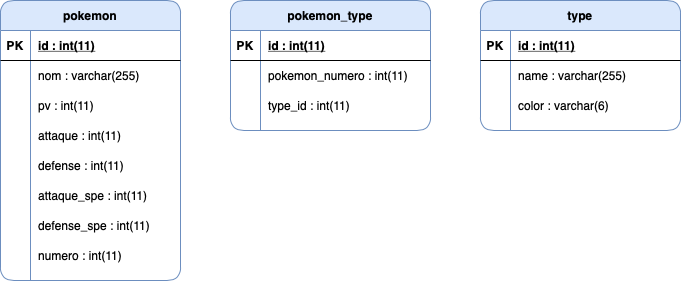
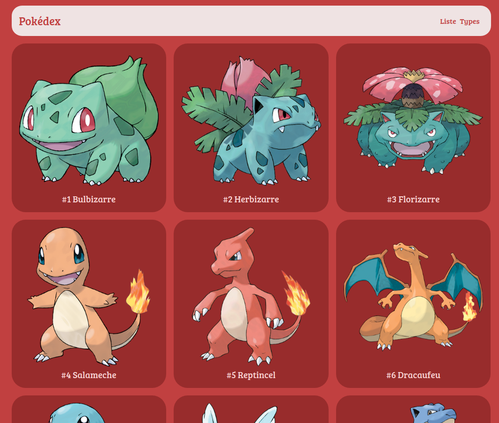
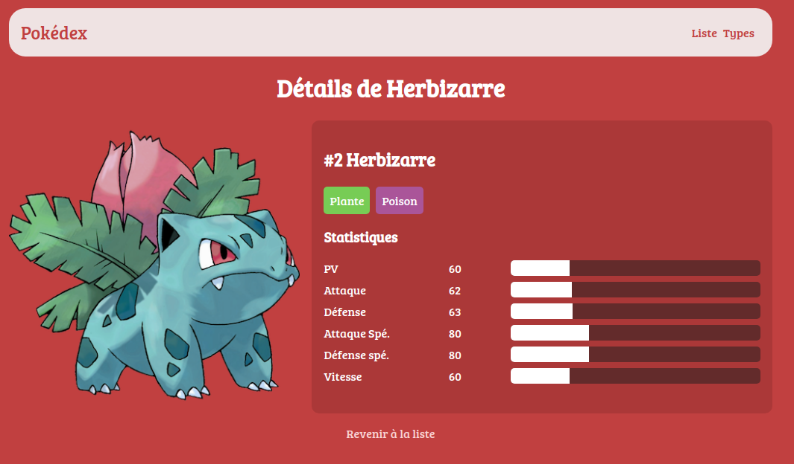
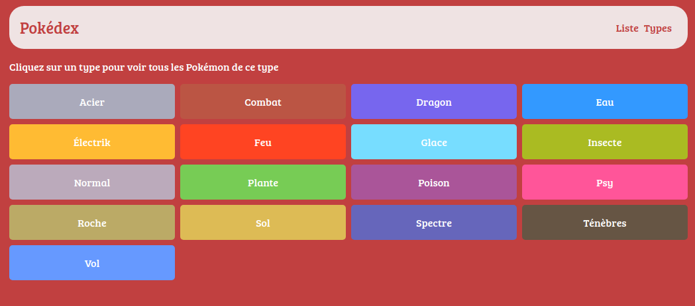
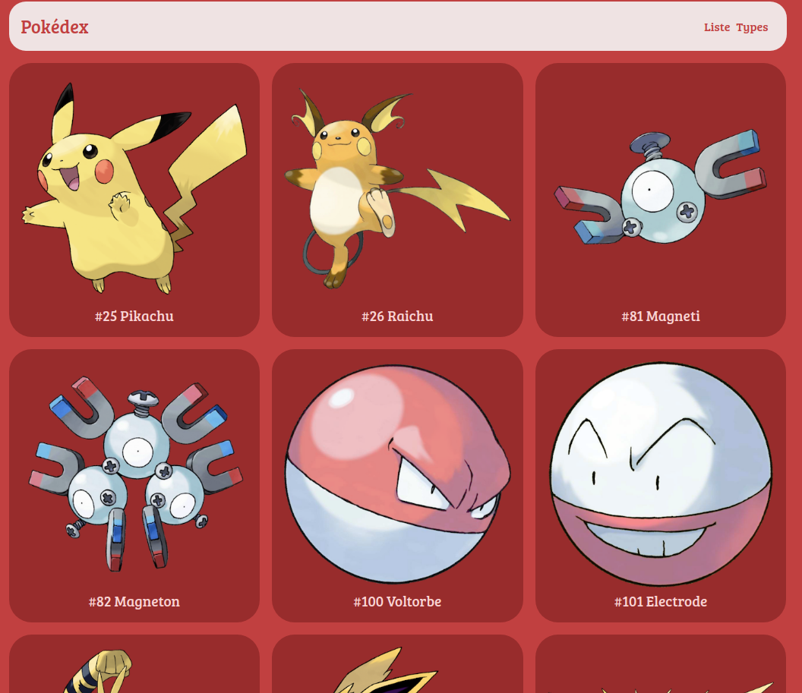

# Pokédex

Ce pokédex recense les 151 pokemon de la région de Kanto.  

J'ai entièrement réalisé ce projet NodeJS lors de mon deuxième mois de formation en développement web FS JavaScrpt.

Ce site est responsive.

## Réalisation

J'ai utilisé express et pour organiser mon code, je me suis basée sur l'architecture MVC.  
J'ai codé ce projet en 1 jour.

## Languages utilisés 

- HTML5, CSS3
- JavaScript 
- PostgreSQL (avec tables relationnelles)
  
 

## Screenshots

### Home page

### Pokemon page

### Types page

### Types of pokemon page
